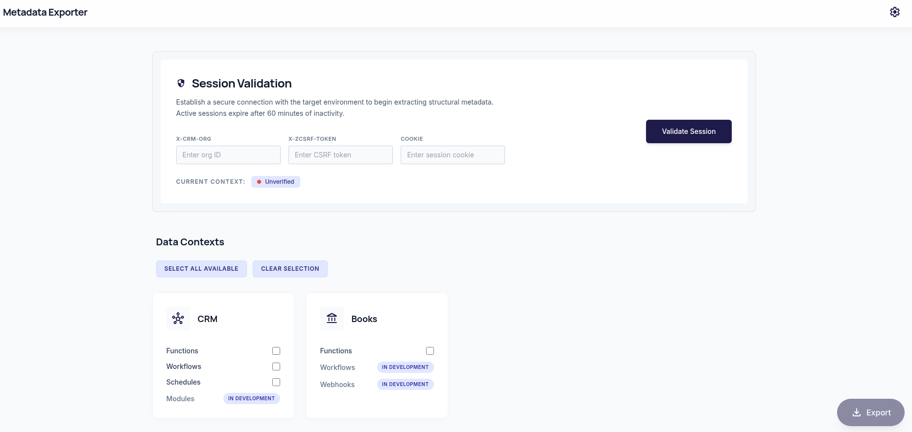
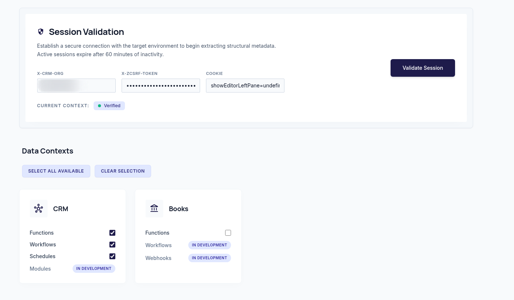

# Zoho Metadata Exporter

A web app that helps end users and developers quickly back up Zoho instance metadata—functions, workflows, schedules, and more—as downloadable, versionable files.

This README is a general overview. For step-by-step setup, session details, deployment options, and troubleshooting, see the **[project wiki](https://github.com/IbyG/zoho-Apps-Scripts-Workflows-Backup/wiki)**.

---

## What is it?

**Zoho Metadata Exporter** is a browser-based tool for exporting structural metadata from your Zoho apps (for example **CRM** and **Books**). Instead of copying configuration by hand, you:

1. Connect using your active Zoho session
2. Choose which data types to export
3. Download packaged archives you can store, diff, or commit to source control

The app uses unofficial Zoho metadata APIs. Use at your own risk in non-production or with appropriate caution.

---

## Why was it built?

Zoho does not provide a built-in way to export metadata to code **manually and at scale**. Functions, workflows, and related configuration live inside the product UI, which makes backups, audits, and environment comparisons difficult.

This project fills that gap: one session, a few clicks, and structured exports per Zoho system.

---

## Quick start

### Prerequisites

- [Node.js](https://nodejs.org/) (LTS recommended)
- npm

### Local development

From the repository root:

```bash
cd web
npm install
npm run dev
```

Open the URL shown in the terminal (typically `http://localhost:5173`).

To preview a production build:

```bash
npm run build
npm run preview
```

### Docker

You can also run the app via Docker. See the **[wiki — Docker deployment](https://github.com/IbyG/zoho-Apps-Scripts-Workflows-Backup/wiki)** for image build steps, environment variables, and hosting notes.

---

## How to use

You need an **active Zoho session** in your browser (logged into the Zoho apps you want to export from). The exporter does not replace Zoho login—it reuses session details from that browser session.

### 1. Open the export screen

After the app is running, you will see the main export view:



*Add screenshot: `docs/screenshots/01-main-screen.png`*

### 2. Validate your session

Enter your **Organization ID**, **CSRF token**, and **Cookie** from your logged-in Zoho session, then click **Validate Session**.

For where to find these values, cookie lifetime, and validation behavior, see the wiki:

**[Validate session (wiki)](https://github.com/IbyG/zoho-Apps-Scripts-Workflows-Backup/wiki/Validate-Session)**

### 3. Select data contexts

Choose the Zoho systems and data types you want to download (for example CRM Functions, CRM Workflows, Books Functions). Only options marked **Available** can be exported; others may appear as **In Development**.



*Add screenshot: `docs/screenshots/02-select-data-contexts.png`*

Use **Select All Available** or pick individual rows. Optional: open **Settings** to customize ZIP file naming patterns.

### 4. Export

Click **Export**. When processing finishes, your browser downloads one or more ZIP files—typically **one archive per selected export per system** (for example separate files for CRM Functions and CRM Workflows).


*Add screenshot: `docs/screenshots/03-export-download.png`*

---

## What you get

Each download is a ZIP archive. Inside you will find:

| Content | Description |
|--------|-------------|
| **Per-item `.json` files** | Full API payload for each function, workflow, schedule, etc. |
| **Per-item `.txt` files** | Human-readable summary of the same item |
| **Aggregate JSON** | A rollup file (for example `_AllWorkflows.json`) listing everything exported in that job |

Example layout after exporting CRM Workflows and Books Functions:

```
Zoho-CRM-Workflows-Export-2026-06-13.zip
  workflows/
    _AllWorkflows.json
    ModuleName-WorkflowName-123456.json
    ModuleName-WorkflowName-123456.txt
    ...

Zoho-Books-Functions-Export-2026-06-13.zip
  functions/
    _AllFunctions.json
    ...
```

Exact names depend on your **Settings** ZIP naming patterns and which contexts you selected.

---

## Screenshots

Place project screenshots under `docs/screenshots/` and update the paths above if you use different filenames.

| File | Purpose |
|------|---------|
| `docs/screenshots/01-main-screen.png` | Main UI after opening the app |
| `docs/screenshots/02-select-data-contexts.png` | Data context / system selection |
| `docs/screenshots/03-export-download.png` | Export action or resulting download |

---

## Further reading

- **[Project wiki](https://github.com/IbyG/zoho-Apps-Scripts-Workflows-Backup/wiki)** — detailed usage, session setup, Docker, and FAQ
- **`Maintenance-Documentation/`** — guides for contributors (adding export options, icons, etc.)

---

## License

MIT — see repository license file for details.
